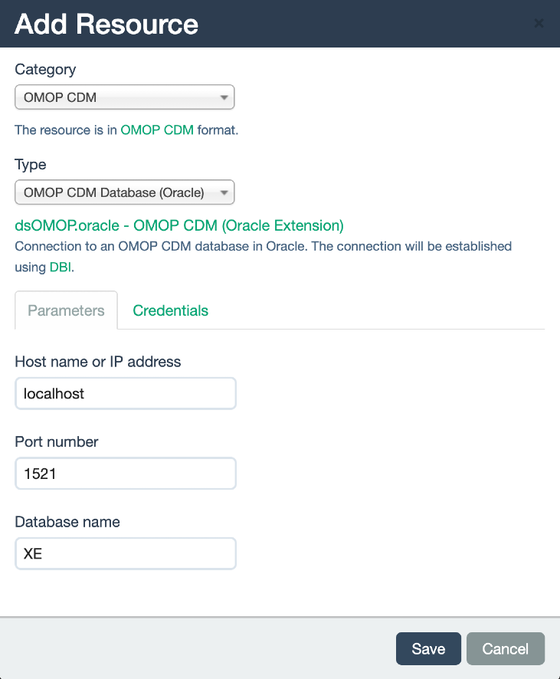

# dsOMOP Oracle Extension

`dsOMOP.oracle` is an extension of the [`dsOMOP`](https://github.com/isglobal-brge/dsOMOP) package. It expands its functionality to support the interaction with Oracle databases. 

## Prerequisites

To use the `dsOMOP.oracle` package, you need to have the following packages installed on your system:
- [`dsOMOP`](https://github.com/isglobal-brge/dsOMOP)
- [`oracle.resourcer`](https://github.com/isglobal-brge/oracle.resourcer)

The installation of `dsOMOP.oracle` will fail if either of these two components is not installed correctly on the system.

**Important:** Please note that the `oracle.resourcer` package requires the Oracle Instant Client Basic and SDK components to be installed on your system. For more detailed installation instructions, please refer to the [oracle.resourcer installation guide](https://github.com/isglobal-brge/oracle.resourcer/blob/main/README.md#installation).

## Example Dockerfile

For a comprehensive setup, you can use the provided Dockerfile to create an environment with all the necessary dependencies for using `dsOMOP.oracle`. The Dockerfile sets up a rock instance and includes all the required Oracle Instant Client components, as well as the following packages: `oracle.resourcer`, `dsOMOP`, and `dsOMOP.oracle`.

You can find the Dockerfile at the following link: [dsOMOP.oracle Dockerfile](inst/docker/Dockerfile)

## Usage 

Having `dsOMOP.oracle` properly installed on an Opal server will extend the resource creation interface provided by the Opal server. Specifically, it will add a new category under the creation of OMOP CDM resources from `dsOMOP`, named `OMOP CDM Database (Oracle)`.

This new category allows users to easily configure and manage resources specifically designed for OMOP CDM databases using Oracle directly from the GUI.

To use it, simply access the management dashboard of a project and go to the `Resources` subsection. In the `Add Resource` option, you will find the `OMOP CDM` category, and under it, the `OMOP CDM Database (Oracle)` option:

  

The parameters for creating an `OMOP CDM Database (Oracle)` resource are the same as those described in the [OMOP CDM Resource Creation guide](https://github.com/isglobal-brge/dsOMOP/blob/main/README.md#creating-omop-cdm-resources), except for the `driver` parameter, which will always be Oracle.
